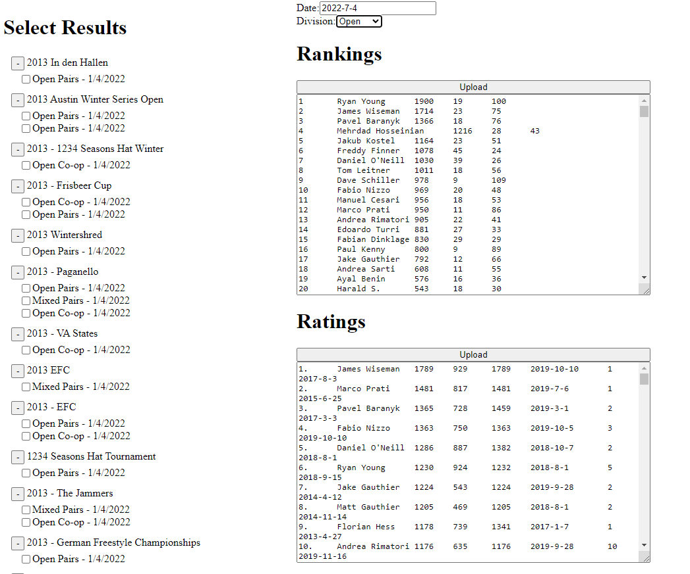

# Points Service

Two parts. Backend microservice that stores calculated Rankings/Ratings. Frontend client that calculates Rankings/Ratings.

## Backend
Uses a dynamo table and s3 bucket to cache JSON files. Each JSON file is 1 division's worth of data

## Frontend
Contains all the math to calculate Rankings/Ratings

  

